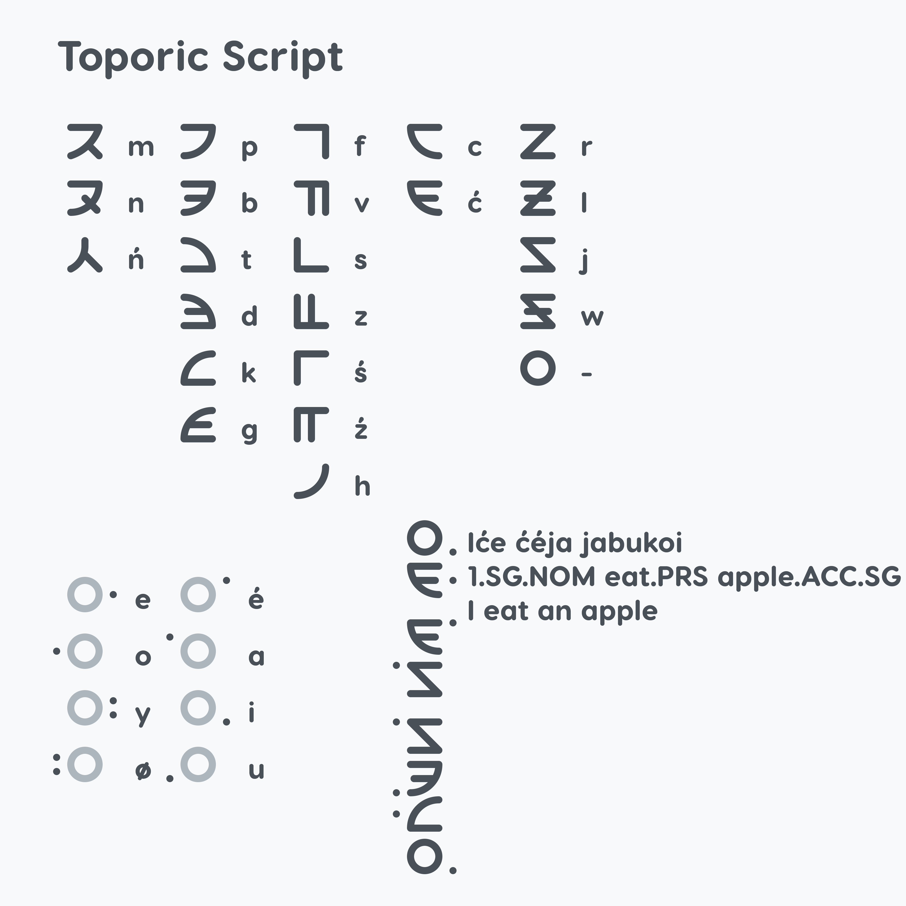

# Toporic

## Info

Toporic, known natively as "géloś Topory" /gəloʃ topory/ is a language. Insert stuff here

## Phonology

### Consonants

|             | Bilabial | Alveolar | Palatal | Velar | Glottal |
|-------------|----------|----------|---------|-------|---------|
| Nasal       | m        | n        |         | ŋ     |         |
| Plosive     | p b      | t d      |         | k g   | (ʔ)     |
| Fricative   | f v      | s z      | ʃ ʒ     |       | h       |
| Affricate   |          | ts       | tʃ      |       |         |
| Approximant |          | l r      | j       | w     |         |

### Vowels

|           | Front | Central | Back |
|-----------|-------|---------|------|
| Close     | i y   |         | u    |
| Mid       | e ø   | ə       | o    |
| Open      |       | a       |      |

### Phonotactics

Toporic follows a (C)V(C) syllable structure, where:

* C (the initial consonant) can be any consonant except for [ŋ].
* V (the vowel) can be any vowel.
* C (the final consonant) can be any consonant including [ŋ].

### Orthography

All letters are written as their IPA, except for these:

* [ʒ] is written as "ź"
* [ʃ] is written as "ś"
* [ts] is written as "c"
* [tʃ] is written as "ć"
* [ŋ] is written as "ń"
* [ə] is written as "é"

#### Allophones

[ʔ] only occurs between 2 vowels and may be pronounced depending on the speaker.

#### Capitalisation

Start of sentences and proper nouns are capitalised.

#### Toporic Script

Toporic also has a featural vertical alphasyllabary.

## Grammar

**Toporic uses V2 word order. Example:**

Iće joja jabukoi  
1.SG.NOM have.PRS apple.ACC.SG  
"I have an apple"

Pasdag jora iće jabukoi  
yesterday have.PST 1.SG.NOM apple.ACC.SG  
"Yesterday I had an apple"

**Toporic has 6 cases: Nominative, Accusative, Genitive, Dative, Locative and Instrumental. Example:**

Iće sadaja jabukoi yću  
1.SG.NOM give.PRS apple.ACC.SG 3.SG.DAT  
"I gave the apple to them"

Ićo libere tabelé  
1.SG.GEN book.NOM.SG table.LOC.SG  
"My book is on the table"

Iće ćéja jabukoi føky  
1.SG.NOM eat.PRS apple.ACC.SG fork.INS.SG  
"I eat an apple with a fork"

**Toporic also has 3 grammatical numbers for nouns: Singular, Dual and Plural. Example:**

| Case/Number  | Singular | Dual | Plural |
|--------------|----------|------|--------|
| Nominative   | -e       | -ne  | -me    |
| Accusative   | -i       | -ni  | -mi    |
| Genitive     | -o       | -no  | -mo    |
| Dative       | -u       | -nu  | -mu    |
| Locative     | -é       | -né  | -mé    |
| Instrumental | -y       | -ny  | -my    |

**Toporic has 3 tenses: Past, Present and Future. It also has suffixes for modal verbs. Example:**

Iće joja jabukoi  
1.SG.NOM have.PRS apple.ACC.SG  
"I have an apple"

Iće jora jabukoi  
1.SG.NOM have.PST apple.ACC.SG  
"I had an apple"

Iće jowa jabukoi  
1.SG.NOM have.FUTs apple.ACC.SG  
"I will have an apple"

| Tense/Modal | -   | Negation | Possibility | Ability |
|-------------|-----|----------|-------------|---------|
| Past        | -ra | -re      | -ré         | -ro     |
| Present     | -ja | -je      | -jé         | -jo     |
| Future      | -wa | -we      | -wé         | -wo     |

**Other miscellanous suffixes:**

| Suffix | Part of Speech | Meaning      |
|--------|----------------|--------------|
| -da    | Verb           | Imperative   |
| -li    | Noun           | Dimunitive   |
| -te    | Noun           | Augmentative |
| -kø    | Noun           | Derogative, Pejorative |
| -śé    | Noun           | Question     |
| -si    | Any            | (make the word a) Noun |
| -se    | Any            | Verb         |
| -sa    | Any            | Adverb       |
| -so    | Any            | Adjective    |

**Example:**

ćéda jabukoi!  
eat.IMP apple.ACC.SG  
"Go eat an apple!"

myseli  
mouse.NOM.SG.DIM  
"Little mouse"

kotete  
mouse.NOM.SG.AUG  
"Big mouse"

hynekø  
mouse.NOM.SG.PEJ  
"Dog (pretend this is an insult)"

vagéeśé hyni?  
color.NOM.SG.WH dog  
"What color is the dog?"

**Pronoun Charts:**

**First Person:**

| Cases/Number | Singular | Dual | Plural |
|--------------|----------|------|--------|
| Nominative   | iće      | ine  | ime    |
| Accusative   | ići      | ini  | imi    |
| Genitive     | ićo      | ino  | imo    |
| Dative       | iću      | inu  | imu    |
| Locative     | ićé      | iné  | imé    |
| Instrumental | ićy      | iny  | imy    |

**Second Person:**

| Cases/Number | Singular | Dual | Plural |
|--------------|----------|------|--------|
| Nominative   | tyće     | tyne | tyme   |
| Accusative   | tyći     | tyni | tymi   |
| Genitive     | tyćo     | tyno | tymo   |
| Dative       | tyću     | tynu | tymu   |
| Locative     | tyćé     | tyné | tymé   |
| Instrumental | tyćy     | tyny | tymy   |

**Third Person:**

| Cases/Number | Singular | Dual | Plural |
|--------------|----------|------|--------|
| Nominative   | yće      | yne  | yme    |
| Accusative   | yći      | yni  | ymi    |
| Genitive     | yćo      | yno  | ymo    |
| Dative       | yću      | ynu  | ymu    |
| Locative     | yćé      | yné  | ymé    |
| Instrumental | yćy      | yny  | ymy    |

**Demonstrative:**

| Cases/Number | Singular Near | Dual Near | Plural Near | Singular Far | Dual Far | Plural Far |
|--------------|---------------|-----------|-------------|--------------|----------|------------|
| Nominative   | eće           | ene       | eme         | aće          | ane      | ame        |
| Accusative   | eći           | eni       | emi         | aći          | ani      | ami        |
| Genitive     | ećo           | eno       | emo         | ećo          | ano      | amo        |
| Dative       | eću           | enu       | emu         | aću          | anu      | amu        |
| Locative     | ećé           | ené       | emé         | ećé          | ané      | amé        |
| Instrumental | ećy           | eny       | emy         | aćy          | any      | amy        |

**Proper nouns:**

Use whatever the proper nouns is (eg. place, person) followed by the name. Example:

lanta Dyć  
land "Deutsch"  
"Germany"

## Vocabulary

You can view the vocabulary [here](https://docs.google.com/spreadsheets/d/1vS3td21X6Sko8n8uLMhWVdT3a2bhQKf_nVDMQl-XM5I/edit?usp=sharing).
